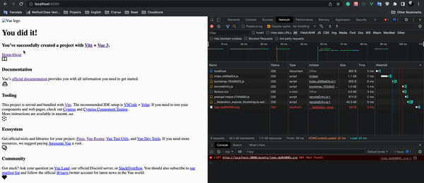

## Reproduced Bug

First, `preload-helper` loads the script on the wrong path.
But after the second attempt, the path is right




### How to reproduce:
```bash
#terminal 1
cd host;
npm i;
npm run build:watch;

#terminal 2
cd host;
npm run preview;

#terminal 3
cd remote-app;
npm i;
npm run build:watch;

#terminal 4
cd remote-app;
npm run preview;
```
and open http://localhost:8080
